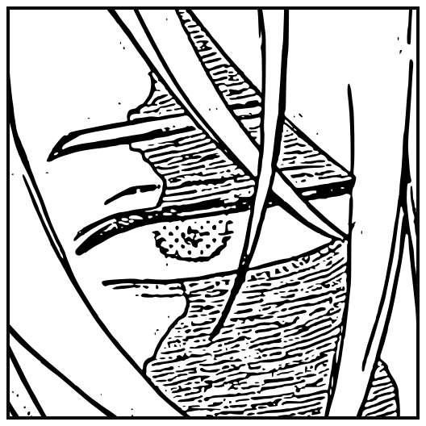

<p align="center">
  
</p>

<h1 align="center">henri</h1>

<p align="center">
  <em>A shared clipboard for all your devices.</em><br>
  Copy on one machine, paste on another. Encrypted, on your own network, no account, no cloud.
</p>

<p align="center">
  
  
  
</p>

---

## What it does

`henri` is a small daemon. It watches your clipboard, and the moment you copy
something it announces the change to your other devices and hands them the new
contents over an encrypted connection. They put it straight on their own
clipboard.

So: <kbd>⌘C</kbd> on the laptop, <kbd>Ctrl+V</kbd> on the desktop. That's the
whole idea.

- **Fifteen words to set up.** `henri init` prints a recovery phrase; type it on
  your other devices. Those words *are* the group key — there is no server and
  no account.
- **Encrypted end to end.** Every byte on the wire is sealed with AES-256-GCM
  under a key only your devices hold.
- **Finds your devices by itself.** Machines on the same network discover each
  other. Anything else you list by address.
- **Mixed groups work.** macOS, Linux and Windows devices all sit in the same
  group — the protocol is identical everywhere and text is normalised to UTF-8
  with `\n` line endings, so a copy on a Mac pastes unchanged on Linux, and
  gets its `\r\n` back when it lands on Windows.
- **Starts at login.** `henri service install` sets it up as a launchd agent or
  a systemd user unit and gets out of the way.
- **One static binary, no dependencies.** Nothing outside the Go standard
  library, no cgo.

---

## Install

The simplest way, no root needed — it lands in `$(go env GOPATH)/bin`:

```sh
go install github.com/justin06lee/henri/cmd/henri@latest
```

Or build it from a clone. Build as yourself, install as root:

```sh
git clone https://github.com/justin06lee/henri
cd henri
make build          # ./henri
sudo make install   # /usr/local/bin/henri
```

`make install` deliberately refuses to compile anything — it only copies the
binary you already built. Running the compiler under `sudo` would scatter
root-owned files through your working tree and break the next ordinary `make`,
and on a repo git considers foreign (an external drive mounted `noowners`, a
Docker bind mount owned by another uid) it fails outright.

To skip root altogether, install somewhere you own:

```sh
make install PREFIX=$HOME/.local    # ~/.local/bin/henri
```

**Linux** additionally needs a clipboard helper — `wl-clipboard` on Wayland, or
`xclip`/`xsel` on X11:

```sh
sudo pacman -S wl-clipboard xclip     # arch
sudo apt install wl-clipboard xclip   # debian, ubuntu
sudo dnf install wl-clipboard xclip   # fedora
```

Install both and henri picks the right one for your session: it prefers
`wl-clipboard` when `WAYLAND_DISPLAY` is set, because on Wayland `xclip` often
talks to an XWayland clipboard your compositor does not share.

macOS and Windows work out of the box (`pbcopy`/`pbpaste`, PowerShell).

---

## Quick start

On your first device:

```console
$ henri init
Started a new clipboard group.

  config   /home/you/.config/henri/config.json
  device   laptop
  group    JS8lEL6zZyc

Your recovery phrase — these 15 words are the whole secret:

    1. glue         2. report       3. social       4. awake
    5. strike       6. piano        7. arm          8. awesome
    9. wage        10. eternal     11. bean        12. smile
   13. real        14. release     15. couple

On every other device, run `henri join` and type those words in when
it asks for them.
```

Type those words on every other device:

```console
$ henri join
Recovery phrase (the words `henri init` printed): glue report social awake …
Joined group JS8lEL6zZyc as "desktop".
```

`henri join <words>` still works and is still in a lot of muscle memory, but it
is the worse way to move a group key: a command line is readable by every other
user on the machine through `ps auxww`, and your shell writes it into its
history file. With nothing after `join`, henri asks — and if stdin is not a
terminal it reads the phrase from there, so `henri join < phrase.txt` works too.

You do not have to be precise about it. Case, punctuation and stray whitespace
are all ignored, and because no two words in the list share their first four
letters you can abbreviate every one of them:

```console
$ henri join
Recovery phrase (the words `henri init` printed): glue repo soci awak stri pian arm awes wage eter bean smil real rele coup
```

Get a word wrong and henri says so, instead of quietly building the wrong key:

```console
$ henri join
Recovery phrase (the words `henri init` printed): glue report socail awake strike …
henri: mnemonic: word 3: "socail" is not one of the words — did you mean "social"?
```

Get the *order* wrong and the checksum catches that too:

```console
$ henri join
Recovery phrase (the words `henri init` printed): report glue social awake strike …
henri: mnemonic: that phrase does not check out — every word is real, so one of
them is probably in the wrong place or slightly wrong
```

Then start the daemon on each device:

```sh
henri daemon
```

That's it. Copy something on one device and it is on the others' clipboards
before you can switch windows.

To stop babysitting a terminal, install it as a background service that starts
at login:

```sh
henri service install
```

Lost the phrase? `henri code` prints it again on any device still in the group.

---

## Commands

| Command | What it does |
| --- | --- |
| `henri init` | Start a new clipboard group on this device |
| `henri join` | Join an existing group; asks for the recovery phrase |
| `henri join <words>` | The same, with the phrase on the command line — see the warning above |
| `henri code` | Print this group's recovery phrase again |
| `henri daemon` | Run the sync daemon in the foreground |
| `henri service install` | Run henri in the background, starting at login |
| `henri service status` | Is it installed, enabled and running? |
| `henri service logs` | Follow the background daemon's output |
| `henri service restart` | Restart it after a config change |
| `henri service uninstall` | Stop it and remove the unit |
| `henri status` | Show what the local daemon is doing |
| `henri doctor` | Check everything sync needs and say what is wrong |
| `henri doctor -fix` | The same, and offer to open the firewall ports |
| `henri peers` | List known devices |
| `henri peers add <host:port>` | Add a device that discovery can't reach |
| `henri peers rm <host:port>` | Remove one |
| `henri send` | Send the current clipboard to the group |
| `henri send -highlighted` | Copy the highlighted text here *and* send it |
| `henri hotkey install` | Bind a key to `henri send -highlighted`, for desktops henri cannot watch |
| `henri hotkey status` | Show the current binding |
| `henri hotkey uninstall` | Remove it |
| `henri leave` | Remove this device's config and leave the group |
| `henri version` | Print the version |

`henri status` is the one to reach for when something looks wrong:

```console
$ henri status
henri  ● running

  device     laptop  (dQw4w9WgXcQ)
  group      BY_l6z_OVEA
  clipboard  pbpaste
  listening  :47600
  discovery  on · 412 beacons · last 4s ago
  uptime     4h12m   pid 5512
  traffic    38 sent · 51 received
  last       1.2 KiB from desktop, 6s ago

peers
  ● desktop            192.168.1.42:47600     discovered  3s ago
  ● phone              192.168.1.77:47600     discovered  9s ago
  ○ —                  10.8.0.4:47600         config      never
```

The `discovery` line is the one to read when the peer list is emptier than it
should be. "on" on its own used to be all it said, which a daemon whose
multicast membership had been dropped went on reporting perfectly cheerfully
while hearing nothing at all. Now it counts, and complains:

```console
$ henri status
  discovery  on · 12 beacons · last 17m4s ago
  …

⚠  Discovery is on, but nothing has been heard for 17m4s.

   Devices announce themselves every 10 seconds, so either nothing else in
   this group is running, or this device has stopped hearing them: a Wi-Fi
   roam, a suspend or a VPN coming up drops the multicast membership without
   telling the socket. henri takes it out again about once a minute.

   If another device is definitely running, check `henri status` there, and
   that UDP 47601 is allowed on both. To stop depending on multicast:

       henri peers add <host:port>
```

`henri status` exits non-zero when the daemon is not running, so
`until henri status; do sleep 1; done` is a wait loop that terminates. It still
prints its friendly stopped page on stdout; only the exit status differs.

---

## How it works

```
   you press ⌘C
        │
        ▼
  ┌───────────────┐   polls every 400ms
  │    watcher    │   has the content changed?
  └───────┬───────┘
          │ yes
          ▼
  ┌──────────────────────────┐
  │  seal   AES-256-GCM      │
  │  key    HKDF(group key)  │
  └────────────┬─────────────┘
               │  TCP :47600
      ┌────────┼────────┐
      ▼        ▼        ▼
  ┌───────┐┌───────┐┌───────┐
  │desktop││ phone ││  vps  │
  └───────┘└───────┘└───────┘
   open · verify · write to the local clipboard

  discovery: every 10s each device multicasts an encrypted
  "hello" to 239.42.47.60:47601 so the others learn its address,
  and re-takes its multicast membership about once a minute so a
  network that moves underneath it does not leave it deaf
```

A few details that matter:

**Changes are noticed, not hunted for.** Where the system will say when the
clipboard changed, henri listens instead of asking: `wl-paste --watch` on
Wayland, `clipnotify` on X11 if it is installed. Both mean henri touches the
clipboard only when something actually happened. `henri status` shows which one
is in use.

Where neither is available it falls back to checking every 400ms, which works
everywhere but has a cost: each check spawns a helper process, and on Wayland
reading a selection can require briefly taking keyboard focus. Two and a half
times a second, that is a visible flicker.

**Discovery re-joins the network it is on.** A multicast membership belongs to
an interface, and the kernel drops it when that interface goes — a Wi-Fi roam, a
suspend, a DHCP renew, a VPN coming up. Nothing tells the socket, so a daemon
that was listening happily an hour ago sits there stone deaf while it carries on
announcing itself. henri throws the membership away and takes it out again about
once a minute, and sooner when it has heard nothing for 40 seconds. `henri
status` shows how many beacons it has heard and how long ago, and says so
plainly when the answer is "not for a while".

**No echo storms.** Each device remembers the SHA-256 of the clipboard content
it currently considers in sync. A device claims that fingerprint *before* it
writes an incoming payload, so its own watcher sees the new content as
already-known and never bounces it back.

**The phrase is the secret.** `henri init` draws 160 bits from the system CSPRNG
and renders them as fifteen words using [BIP-39](https://github.com/bitcoin/bips/blob/master/bip-0039/mnemonic.md),
the same scheme cryptocurrency wallets use for seed phrases. The group's master
key and its ID are both derived from that entropy with HKDF-SHA256, so the words
are the only thing worth writing down. Five of the 165 bits are a checksum,
which is what lets henri tell you that word 3 is wrong instead of building a key
that silently never matches.

**Two keys, one secret.** The 32-byte group key in your config is never used
directly. HKDF-SHA256 derives one key for clipboard payloads and another for
discovery beacons, so a beacon can't be replayed as a payload. The group ID is
mixed in as additional authenticated data.

**Membership is the key.** There is no login. Sealing a message correctly is
what proves a device is in the group; anything that fails to authenticate is
dropped without a reply.

**Every frame is delivered once.** Each message carries a timestamp and is
refused if it is more than two minutes away from this device's clock. On its own
that left a two-minute window in which a frame captured off the wire was as good
as the original — long enough to put an old clipboard back under you at the
moment you paste, or to re-home a peer with a replayed beacon. So henri also
remembers the random nonce of every frame it has acted on for the length of that
window, and refuses the same frame a second time.

Payloads carry a hash of their contents too, but that is a consistency check and
not a defence: it travels *inside* the sealed envelope, so anyone able to change
it could change the payload it describes. It catches a bug, not an attacker.

---

## Configuration

`~/.config/henri/config.json` (override with `$HENRI_CONFIG` or
`$XDG_CONFIG_HOME`; `%APPDATA%\henri\` on Windows). It is written `0600` and
`henri` refuses to start if anyone else can read it — it holds your group key.

That permission check is a Unix one, and henri skips it on Windows, where the
mode bits Go reports say nothing about who can open the file. On Windows keep
`%APPDATA%\henri\` somewhere only your account can read.

`group_id` and `key` are both derived from `phrase`, and henri checks that they
still are every time it reads the file. Editing one of them without the other —
or swapping in somebody else's — is refused rather than quietly obeyed, because
a config that syncs to a group other than the one its words name is exactly what
that would look like from the outside.

If `~/.config` is a symlink into a dotfiles directory, saving follows it: henri
writes the file the link points at and leaves the link alone.

```json
{
  "group_id": "JS8lEL6zZyc",
  "key": "ZR+ykCc7xXwnDQkC55jkGw/n4gy66Bd1WPGcavgBvb8=",
  "phrase": "glue report social awake strike piano arm awesome wage eternal bean smile real release couple",
  "device_id": "-wYRDywIF9A",
  "device_name": "laptop",
  "listen_port": 47600,
  "discovery_port": 47601,
  "discovery": true,
  "peers": ["10.8.0.4:47600"],
  "poll_interval_ms": 400,
  "max_payload_bytes": 4194304
}
```

| Key | Default | Notes |
| --- | --- | --- |
| `phrase` | generated | The recovery phrase. `group_id` and `key` are derived from it. **This is the credential.** |
| `group_id` | derived | Identifies the group; shared by every device in it |
| `key` | derived | The 32-byte group secret, base64 |
| `device_id` | generated | Unique per device; not shared |
| `device_name` | hostname | What shows up in `henri peers` |
| `listen_port` | `47600` | TCP port that receives clipboard updates |
| `discovery_port` | `47601` | UDP port for multicast beacons |
| `discovery` | `true` | Set `false` to rely only on `peers` |
| `peers` | `[]` | Devices to always push to — for anything off the LAN |
| `poll_interval_ms` | `400` | How often the clipboard is checked, when no event source is available |
| `clipboard_poll_only` | `false` | Ignore event sources and always poll |
| `max_payload_bytes` | `4194304` | Clipboards larger than this are skipped |

Devices that aren't on the same network — a VPS, or a laptop behind a different
router — won't be found by multicast. Add them by address:

```sh
henri peers add 10.8.0.4:47600
henri peers add 10.8.0.4                # :47600 is assumed
henri peers add [fd00::4]:47600         # IPv6 goes in brackets, as ever
```

An address that is not one — a port that is not a number, or not a port — is
refused when you add it rather than accepted and then silently never dialled.
Discovery itself is IPv4 multicast; peers listed by address can be either.

Over the open internet, put henri inside a WireGuard or Tailscale network rather
than forwarding port 47600. The payloads are encrypted either way, but there's
no reason to expose the listener.

### Mixing macOS and Linux

Nothing extra to configure — install henri on both, join them to the same group,
and they sync. Two things are worth knowing:

- **Linux needs a clipboard helper** (`wl-clipboard`, `xclip` or `xsel`), and it
  has to run inside your graphical session. A daemon started from a bare SSH
  shell has no clipboard to watch; `henri status` will show `clipboard  none`.
- **Open the ports.** Most Linux distributions ship a firewall that refuses
  inbound connections. Run `henri doctor -fix` and it will do this for you.

If discovery does not find the other machine, `henri peers add <ip>:47600` on
both sides skips it entirely and tells you quickly whether the problem is
multicast or the firewall.

### One-directional sync is always a firewall

This is worth its own heading because of how badly it disguises itself.

A firewall filters **inbound** traffic only. A device with a closed port still
announces itself perfectly well and still pushes its own clipboard out — so
both machines list each other in `henri peers`, everything looks connected, and
copies travel in exactly one direction. It reads like a bug in henri. It is a
closed port on whichever machine is *not receiving*.

```sh
henri doctor
```

tells you which machine that is, because it opens a real connection to every
peer and says what came back:

```console
$ henri doctor
  ✓ clipboard  pbpaste, readable
  ✓ daemon     running, pid 6613, up 11m1s
  ✓ listening  :47600
  ✓ discovery  on · 66 beacons · last 7s ago
  ✓ firewall   macOS application firewall is active and henri's ports are open

  ✗ tenet            192.168.1.253:47600
    refused — the host answered but turned the connection away, which is a
    firewall rejecting it or henri not running there

what to do

  1. henri on tenet cannot be reached. That is a firewall on THAT machine,
     not this one — open tcp/47600 and udp/47601 there. `henri doctor -fix` on
     that device will do it.
```

The distinction it draws is the one that matters. **Refused** means the packet
arrived and was turned away — the host is up, and either a firewall is
rejecting or henri is not running there. **No answer** means the packet vanished,
which is a firewall dropping it or a network that will not carry traffic between
the two devices at all.

Then, on the machine that cannot be reached:

```sh
henri doctor -fix
```

henri finds the firewall — firewalld, ufw, nftables, iptables — and offers the
exact commands to open TCP 47600 and UDP 47601, scoped to your local network
rather than to everything. It asks before running anything, and it never edits a
hand-written nftables or iptables ruleset: putting a rule in the wrong chain, or
after a catch-all drop, is worse than printing it and letting you place it.

By hand, if you would rather:

```sh
# firewalld — Fedora, and common on Arch
sudo firewall-cmd --permanent --add-rich-rule='rule family="ipv4" source address="192.168.1.0/24" port port="47600" protocol="tcp" accept'
sudo firewall-cmd --permanent --add-rich-rule='rule family="ipv4" source address="192.168.1.0/24" port port="47601" protocol="udp" accept'
sudo firewall-cmd --reload

# ufw — Debian, Ubuntu
sudo ufw allow from 192.168.1.0/24 to any port 47600 proto tcp
sudo ufw allow from 192.168.1.0/24 to any port 47601 proto udp
```

Open **both**. Opening only TCP is a trap: the clipboard would transfer if
discovery ever worked, and discovery is the UDP port, so it never will.

On macOS there is nothing to open — the firewall there filters by application
and prompts the first time henri listens. If you turned on "Block all incoming
connections", henri cannot receive anything; `henri doctor` says so.

---

## Running it for real

`henri daemon` runs in the foreground, which is useful for watching what it
does but not for actually living with. To have it run in the background and
come back at login:

```sh
henri service install
```

That is all of it. On macOS it writes a launchd agent, on Linux a systemd user
unit, and starts it straight away:

```console
$ henri service install
Installing henri as a launchd service.

  binary   /usr/local/bin/henri
  unit     /Users/you/Library/LaunchAgents/com.justin06lee.henri.plist

Waiting for it to start

henri is running in the background and will start again at login.
```

The rest:

```sh
henri service status      # installed? running? will it come back at login?
henri service logs        # follow its output
henri service restart     # after changing the config
henri service uninstall   # stop it and remove the unit
```

Both run as *your* user inside your graphical session, on purpose: the clipboard
belongs to that session, so a system-wide daemon could not reach it.

### After upgrading henri, re-run `henri service install`

It is idempotent, and nothing else rewrites the unit file — so an existing
install keeps whatever was written the first time, bugs included.

- **macOS.** launchd hands a job an environment with no locale at all, and
  `pbcopy`/`pbpaste` take their text encoding from `LANG`, falling back to plain
  C when it is unset. Every accented character, curly quote, em dash, CJK
  character and emoji was mangled in both directions — but only under launchd,
  so it looked fine everywhere it is easy to test. The plist now sets `LANG`,
  and brings henri back when it *crashes* rather than on any exit at all, which
  used to respawn a daemon that could never start, every few seconds, forever.
- **Linux.** The unit is now wanted by `graphical-session.target` rather than
  `default.target`, so it starts once there is a display to read rather than
  before. `PrivateTmp` is gone: X11's local transport is a socket in
  `/tmp/.X11-unix`, so a private `/tmp` meant `xclip` and `xsel` could never
  open the display, and where unprivileged user namespaces are off the unit
  failed outright at `226/NAMESPACE`.

Until you re-run it, an existing install goes on quietly doing the old thing.

### Two things it checks before installing

A service records one exact binary path and one config location and runs them
forever after, so henri refuses to install if either is somewhere it might not
find later:

- **A binary on removable media.** Point a login service at
  `/Volumes/SomeDrive/henri` and it fails to start every time the drive is out.
  Install to `/usr/local/bin` first.
- **A config on removable media.** This one is easy to miss, because `~/.config`
  is so often a symlink into a dotfiles directory that lives somewhere else. If
  it resolves onto an external volume, the daemon cannot read it at login: the
  volume may not be mounted yet, and macOS gates removable volumes behind a
  permission prompt that a background service has no way to answer — the read
  simply blocks forever.

Move the config to the internal disk and tell henri where it went:

```sh
mkdir -p ~/.henri && mv ~/.config/henri/config.json ~/.henri/config.json
export HENRI_CONFIG=$HOME/.henri/config.json    # add this to your shell rc
henri service install
```

`henri service install` records `HENRI_CONFIG` and `XDG_CONFIG_HOME` in the unit
it writes, so the background daemon reads the same file your shell does. Service
managers start with a bare environment and would otherwise quietly read a
different config.

`-force` overrides either check if you know what you are doing.

### Desktops henri cannot watch

Some compositors will not let any background program read the clipboard. Wayland
hands the selection only to the client holding keyboard focus, and where the
compositor implements no data-control protocol there is no way around it:
reading takes focus, and reading on a timer makes the screen flicker.

henri detects that and **stops watching** rather than flickering at you. It says
so plainly:

```console
$ henri status
  clipboard  wl-clipboard
  watching   press-to-send (this compositor cannot be watched in the background)

This compositor only gives the clipboard to the focused window, so henri
cannot notice copies on its own. Bind a key to push them:

    henri hotkey install
```

That binds **Super+Shift+C** to copy *and* send in one press:

```console
$ henri hotkey install
Bound Super+Shift+C.

  command  /usr/local/bin/henri send -highlighted
```

Highlight some text, press the key. It lands on this device's clipboard and on
every other device's, with no Ctrl+C in between.

That works because highlighted text is already published: X11 and Wayland both
track a **PRIMARY selection** alongside the clipboard, updated by every app as
you drag over text — it is what middle-click pastes. So henri can read what you
have highlighted without synthesising a keystroke or asking the compositor for
anything it does not want to give. With nothing highlighted the key falls back
to sending the clipboard.

Receiving stays automatic — this only affects sending. Pick a different key with
`-accel`, using GNOME's syntax:

```sh
henri hotkey install -accel '<Super><Alt>c'
```

henri can set the binding itself on GNOME. Everywhere else it prints the line to
add to your compositor's config:

```
sway / i3      bindsym $mod+Shift+c exec /usr/local/bin/henri send -highlighted
hyprland       bind = SUPER SHIFT, C, exec, /usr/local/bin/henri send -highlighted
```

If you would rather have automatic syncing and can live with the flicker, poll
anyway:

```json
"clipboard_poll_only": true
```

### If the screen flickers

Symptom: windows flicker or focus jumps every half second while henri runs.

That is the polling fallback. Wayland ties clipboard access to keyboard focus,
so unless the compositor implements a data-control protocol, every read briefly
takes focus — and polling does that 2.5 times a second. Check what henri is
doing:

```console
$ henri status
  clipboard  wl-clipboard
  watching   wl-paste --watch       ← event-driven, no polling
```

If that second line reads `polling every 400ms`, henri could not find an event
source:

- **X11.** Install [`clipnotify`](https://github.com/cdown/clipnotify) — it
  blocks until the selection changes, so henri stops asking entirely.

  ```sh
  yay -S clipnotify              # arch (AUR)
  ```
- **Wayland.** `wl-paste --watch` needs `wlr-data-control` (wlroots: Sway,
  Hyprland, river) or `ext-data-control` (KDE). Where the compositor has
  neither, nothing can read the clipboard in the background at all, and the
  only lever is to poll less often.
- **GNOME Wayland specifically.** [Mutter implements
  neither](https://gitlab.gnome.org/GNOME/mutter/-/work_items/524), deliberately
  — a protocol that lets any background process read the clipboard is the hole
  Wayland set out to close. henri does not poll there at all; see
  [Desktops henri cannot watch](#desktops-henri-cannot-watch) for the hotkey,
  or run henri on X11 where the clipboard is readable without taking focus.

  XWayland is not a way around it. GNOME bridges the two clipboards, but only
  in one direction: an X11 client cannot see what a Wayland client copied
  (`xclip -o` reports `target STRING not available`, and `clipnotify` never
  fires).
- **Either.** Slow the fallback down, in the config:

  ```json
  "poll_interval_ms": 2000
  ```

  Or turn event watching off entirely if it misbehaves:

  ```json
  "clipboard_poll_only": true
  ```

Restart the daemon after editing (`henri service restart`).

### If the clipboard is not readable

On Linux a service can start before the graphical session has published
`DISPLAY` or `WAYLAND_DISPLAY`, leaving the daemon running but unable to read
anything. `henri service install` captures those variables from the session you
run it in and writes them into the unit, which avoids the problem in most
setups. If it still happens, `henri status` says so rather than leaving you to
guess:

```
  clipboard  xclip  ⚠ not readable: Can't open display
```

---

## Leaving a group

To take one device out:

```sh
henri leave
```

That removes the local config and nothing else — your other devices carry on
without it, and you can rejoin later with the same phrase. henri refuses to do
it while the daemon is running, because a running daemon already holds the key
in memory and would keep syncing after the file was gone.

It takes the whole key with it: any half-written temporary copy left by an
interrupted save goes too, and where the config is a symlink so does the file it
links to. `henri leave` names both before it asks.

There is no way to evict a device remotely. If one is lost or you want it out
for good, run `henri init` somewhere to make a new group and re-join the devices
you still trust; the old phrase then opens nothing that matters.

---

## Security

What henri gives you:

- Clipboard contents are encrypted and authenticated with AES-256-GCM. Nothing
  on your network can read one, and nothing without the group key can change one
  in flight: the tag fails and the frame is dropped without a reply.
- A whole frame captured off the wire cannot be delivered a second time. henri
  remembers the nonce of every frame it has acted on for as long as that frame
  would still count as fresh.
- Only devices holding the group key can send or receive.
- The config file holding that key is `0600` on Unix, and henri refuses to run
  if it isn't. It also checks that the group in it is still the group its
  recovery phrase names.

What it does not give you, and you should know:

- **The phrase is the key.** Anyone who has those fifteen words can read
  everything you copy, forever. Read them aloud or type them in by hand; don't
  paste them through a chat app.
- **There is no rotation yet.** To change the key you re-run `henri init` and
  re-join every device.
- **Your clipboard has your passwords in it.** That's true of any clipboard
  sync tool. Copying from a password manager will send that password to every
  device in the group.
- Discovery beacons are encrypted, but their *timing and size* are visible to
  anyone on your LAN — they can tell henri is running, not what you copied.

### Is fifteen words enough?

Yes, with room to spare. Fifteen words drawn from a 2048-word list is 2^160
possible phrases. For scale, twelve words — 2^128, which is what secures
cryptocurrency wallets holding real money — is already past what anyone can
search with any amount of hardware; fifteen is four billion times that again.

The entropy is not where the risk lives. It's in how the words travel: a phrase
read aloud in a room stays in that room, and a phrase pasted into a chat app is
on someone else's servers forever.

`henri init -words 12` is shorter to type and still ample; `-words 24` gives you
256 bits if you would rather.

Phrase lengths are always a multiple of three — 12, 15, 18, 21 or 24. Each word
carries 11 bits and the checksum is a 32nd of the entropy, so the word count
works out to `3 x bits / 32` — 128 bits is twelve words — and only those five
come out whole. There is no
such thing as a 16-word BIP-39 phrase.

Found a problem? Open an issue.

---

## Limitations

- **Text only.** Images and files aren't synced yet.
- **Polling is still the fallback.** With no event source henri checks every
  400ms, which works everywhere but spawns a helper process each time.
- **Two daemons on one machine won't discover each other.** They share a
  clipboard and a multicast port, so only the first to start receives beacons.
  Not a problem in the real configuration — one daemon per device — but worth
  knowing if you're testing on a single box. Use `peers` for that.
- **No history.** henri syncs the current clipboard; it isn't a clipboard
  manager.
- **Discovery is IPv4 only.** Beacons go to an IPv4 multicast group. IPv6
  devices sync perfectly well once you list them with `henri peers add`, but
  they will not find each other on their own.
- **No key rotation.** Changing the group key means `henri init` somewhere and
  re-joining every device.
- **`henri service` is macOS and Linux only.** Windows syncs fine, but has no
  install-at-login integration yet; run `henri daemon` from a shortcut in
  `shell:startup` for now.

---

## Development

```sh
make test    # go test ./...
make race    # go test -race ./...
make vet
make dist    # cross-compile to dist/bin/
```

The tests run whole groups of nodes against a fake clipboard, so they never
touch the real one. They cover propagation between peers, the echo guard,
foreign-key rejection, replays, oversized payloads, and peer expiry. The
mnemonic package is checked against the official BIP-39 test vectors, and the
CLI's own tests cover argument handling, address parsing and the formatting
helpers — against a config in a temporary directory, never yours.

```
cmd/henri            the CLI
internal/config      config file: load, save, validate
internal/mnemonic    BIP-39 recovery phrases
internal/secure      HKDF key derivation and AES-256-GCM
internal/clipboard   per-platform clipboard access
internal/node        the daemon: watcher, peers, discovery, protocol
internal/service     launchd and systemd integration
internal/hotkey      the send-highlighted key binding
internal/firewall    firewall detection for `henri doctor`
assets/              the panel image at the top of this README
```

---

## The name

Named after Henri from **Kindergarten WARS** — a manga by You Chiba, serialized
on Shōnen Jump+ since 2022, about a kindergarten staffed by retired
assassins. The image at the top is traced from a panel of him.

No affiliation with the author or Shueisha. The artwork belongs to them — it's
here because I like the manga.
